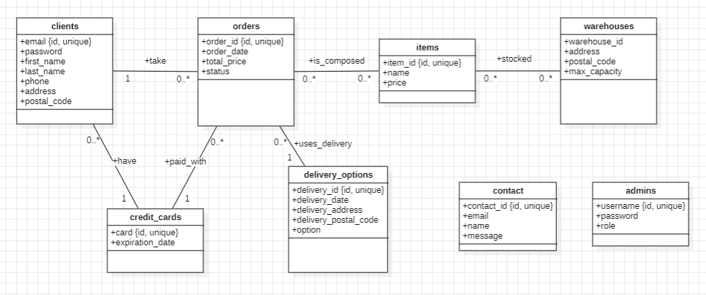

# PLM - project

Here the repository of the project of PLM course.

You will find the following directories/files:
- `captures/`: contains the captures of the application;
- `vnergy/`: contains the Django project;
- `data_to_fixtures/`: contains the script to convert the data to fixtures;
- `diagram.mdj`: contains the diagram of the database;
- `init.sql`: contains the SQL script to create the database and the tables;
- `load_data.sql`: contains the SQL script to load the data into the database.

## How the database is structured

The database is structured in the following way:

## Setup

To setup the project, you need to have MySQL installed. You also need basic libraries for python and in particular **django** and **mysqlclient**.

## How to run the application

To run the application, you need to run the following commands, **in the first `vnergy` directory (the one containing `manage.py`)**:
- `python setup.py` (to create the database, make the migrations and apply them, and load the data)
- `python manage.py runserver` (to run the server)

Here an image of the commands to run, with the expected output:

Then, you can access the application at the following address: `http://127.0.0.1:8000/` (in function of the port used by the server).

## How to use the application

## Some specifications

